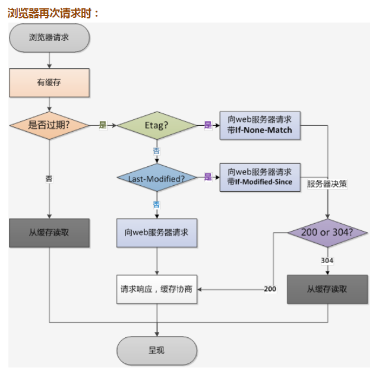

# 缓存

**优点**

1. 减少数据传输，节省网费
2. 减少服务器负担，提升网站性能
3. 加快客户端加载网页速度

---

**缓存规则**
响应体中 Cache-Control 字段

1.  private：仅浏览器可以缓存
2.  public：浏览器和代理服务器都可以缓存
3.  max-age=xxx：过期时间(强缓存)
4.  no-cache：协商缓存
5.  no-store：不缓存

**强缓存**

1. 第一次请求 a.js ，缓存表中没该信息，直接请求后端服务器。
2. 后端服务器返回了 a.js ，且 http response header 中 cache-control 为 max-age=xxxx，所以是强缓存规则，存入缓存表中。
3. 第二次请求 a.js ，缓存表中是 max-age， 那么命中强缓存，然后判断是否过期，如果没过期，直接读缓存的 a.js，如果过期了，则执行协商缓存的步骤了。

**协商缓存**

##### 触发条件：

1. Cache-Control 的值为 no-cache
2. max-age 过期

##### 相关规则：

1. ETag：文件标识(response header)
2. Last-Modified：文件修改时间(response header)
3. If-None-Match：文件表示(request header)
4. If-Modified-Since：文件修改时间(request header)

###### 步骤：

1. 请求资源时，把本地的 If-None-Match 和 If-Modified-Since 带到服务端做比较
2. 如果变化了，返回 200，更新资源
3. 如果没变化，返回 304，直接取缓存   
   
---
