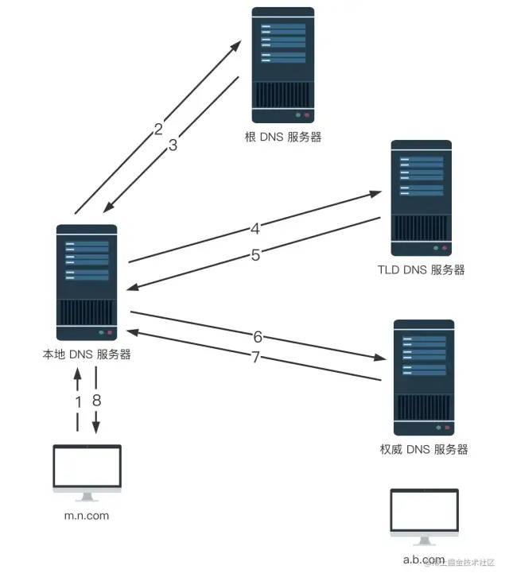

**DNS**

1. 什么是 DNS  
   DNS 即域名系统，全称是 Domain Name System。当我们在浏览器输入一个 URL 地址时，浏览器要向这个 URL 的主机名对应的服务器发送请求，就得知道服务器的 IP，对于浏览器来说，DNS 的作用就是将主机名转换成 IP 地址。  
   DNS 是一个应用层协议，我们发送一个请求，其中包含我们要查询的主机名，它就会给我们返回这个主机名对应的 IP  
   DNS 是一个分层的分布式数据库，整个 DNS 系统由分散在世界各地的很多台 DNS 服务器组成，每台 DNS 服务器上都保存了一些数据，这些数据可以让我们最终查到主机名对应的 IP。
2. 本地服务器  
   当主机发出 DNS 请求时，该请求被发往本地 DNS 服务器，本地 DNS 服务器起着代理的作用，并负责将该请求转发到 DNS 服务器层次结构中。
3. 递归查询、迭代查询  
     
   主机 m.n.com 向本地 DNS 服务器 dns.n.com 发出的查询就是递归查询，这个查询是主机 m.n.com 以自己的名义向本地 DNS 服务器请求想要的 IP 映射，并且本地 DNS 服务器直接返回映射结果给到主机。

   而后继的三个查询是迭代查询，包括本地 DNS 服务器向根 DNS 服务器发送查询请求、本地 DNS 服务器向 TLD 服务器发送查询请求、本地 DNS 服务器向权威 DNS 服务器发送查询请求，所有的请求都是由本地 DNS 服务器发出，所有的响应都是直接返回给本地 DNS 服务器。

4. DNS 缓存  
   在一个 DNS 查询的过程中，当某一台 DNS 服务器接收到一个 DNS 应答（例如，包含某主机名到 IP 地址的映射）时，它就能够将映射缓存到本地，下次查询就可以直接用缓存里的内容。当然，缓存并不是永久的，每一条映射记录都有一个对应的生存时间，一旦过了生存时间，这条记录就应该从缓存移出。
