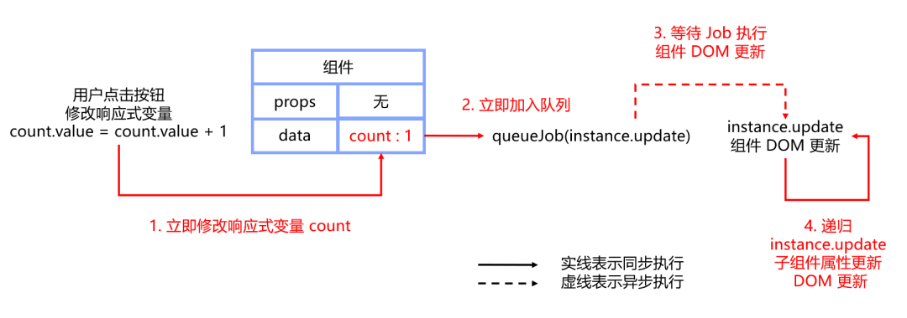
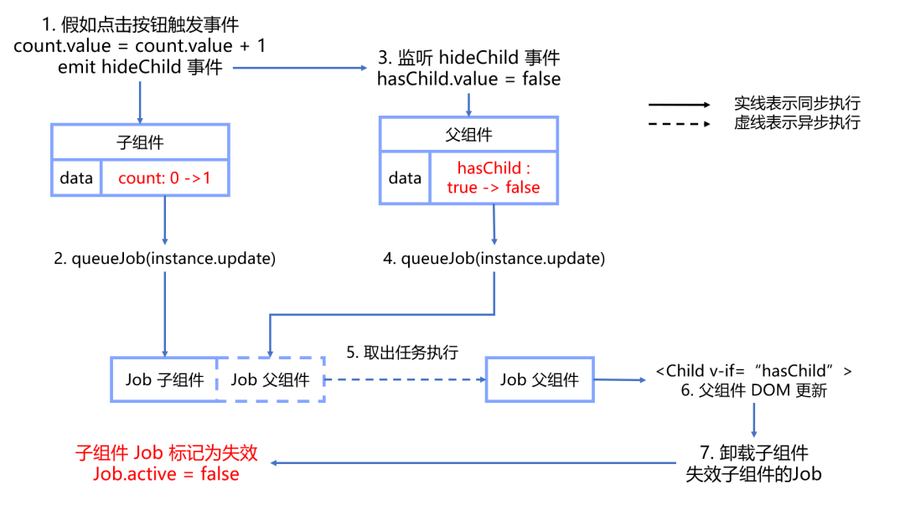
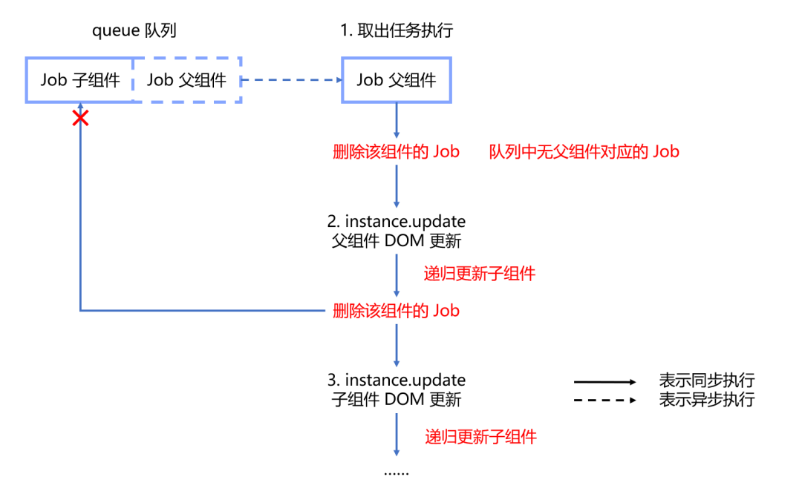
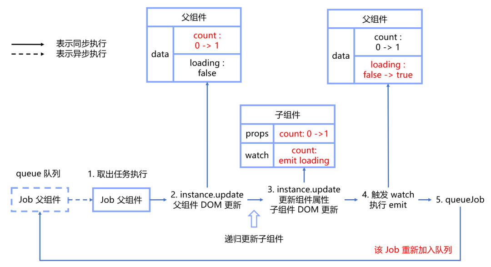

# Vue 3 调度系统

Vue 并不需要解决计算机资源分配的问题（操作系统解决）。Vue 利用调度算法，保证 Vue 组件渲染过程的正确性以及 API 的执行顺序的正确性

**调度算法**

1. 先来先服务，先入队先执行
2. 优先级调度，优先级高的先执行

**Vue 3 调度算法使用**
基于调度算法实现(只控制入队过程，出队由队列本身控制)：

|              | Pre 队列       | queue 队列               | Post 队列      |
| ------------ | -------------- | ------------------------ | -------------- |
|              | 1              | 2                        | 3              |
| 队列作用     | DOM 更新前执行 | DOM 更新时执行           | DOM 更新后执行 |
| 出队方式     | 先进先出       | 优先级 l                 | 优先级         |
| 任务有效性   | 任务全部有效   | 组件卸载时，对应任务失效 | 任务全部有效   |
| 删除任务     | 不需要         | 特殊情况需要             | 不需要         |
| Job 任务递归 | 默认允许       | 默认允许                 | 默认允许       |

因此，源码中提供入队 API：queuePreFlushCb，queueJob，queuePostFlushCb

对于不同的异步回调 API，会根据 API 设计的执行时机，使用不同的队列。  
如：

- watch 的回调函数，默认是在组件 DOM 更新之前执行，因此使用 Pre 队列。
- 组件 DOM 更新，使用 queue 队列。
- updated 生命周期需要在组件 DOM 更新之后执行，因此使用的是 Post 队列。

**组件更新**

响应式数据更新 ≠ 组件 DOM。数据修改是立即生效的，但 DOM 修改是延迟执行

**优先级机制**
只有 queue 队列和 Post 队列，是有优先级机制的，job.id 越小，越先执行。

queue:执行组件 DOM 更新，组件存在父子关系，因此需要先更新父组件，再更新子组件。因此根据组件树自顶向下创建的顺序作为 job。id 就可以达到父组件优先级>子组件优先级  
post:等 DOM 更新后，再执行或者用户手动设置 watch 回调在 DOM 更新之后执行(watchPostEffect)，只有一种 job 需要提前执行，那就是更新模板引用。因此对于更新模板引用的 job 将其 id 设为-1 即可，其它 job 没有 id，会加入到队尾就可以实现优先级队列

**失效任务**
当组件被卸载（unmounted）时，queue 队列中的 Job 会失效，因为不需要再更新该组件了  

**删除任务**
组件 DOM 更新是深度更新，会递归的对所有子组件执行 instance.update。因此，在父组件深度更新完成之后，不需要再重复更新子组件，更新前，需要将组件的 Job 从队列中删除

**Job 递归**
Job 在更新组件 DOM 的过程中，依赖的响应式变量发生变化，又调用 queueJob 把自身的 Job 加入到队列中。  

