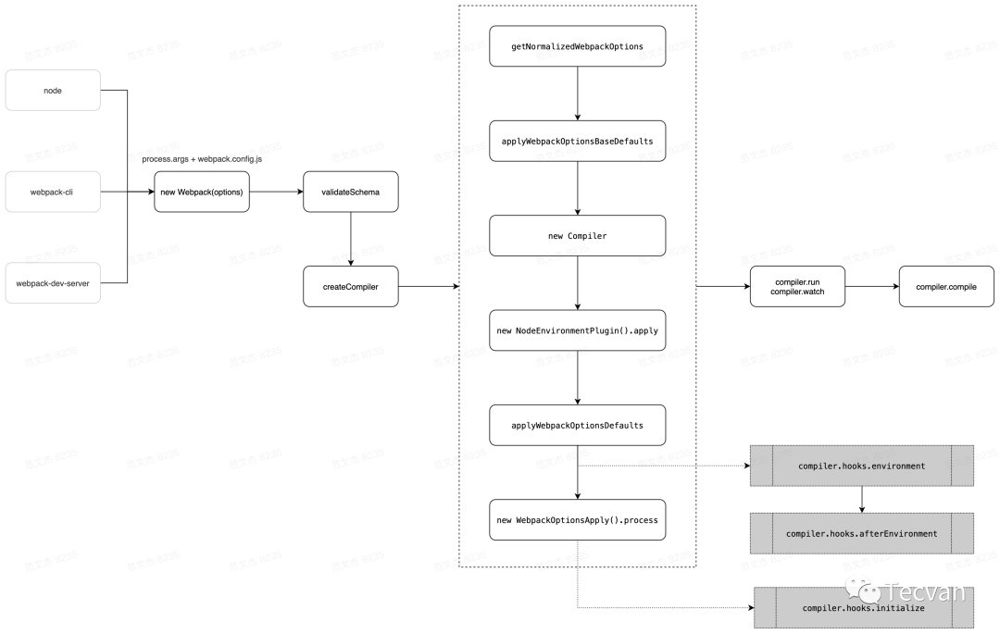
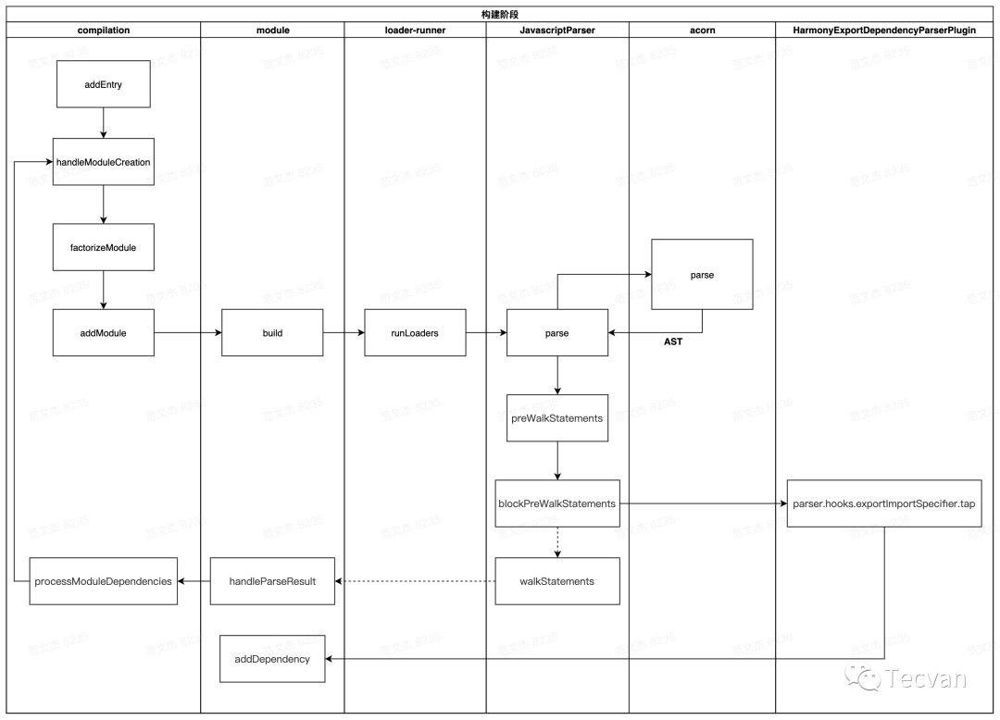
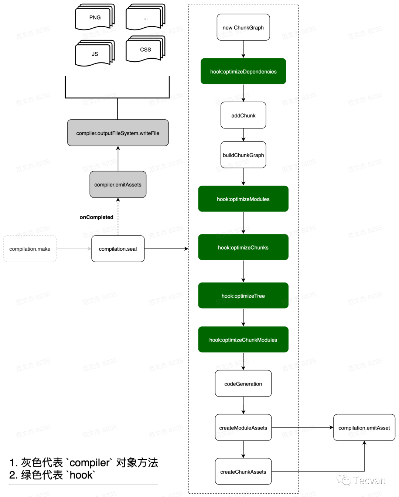
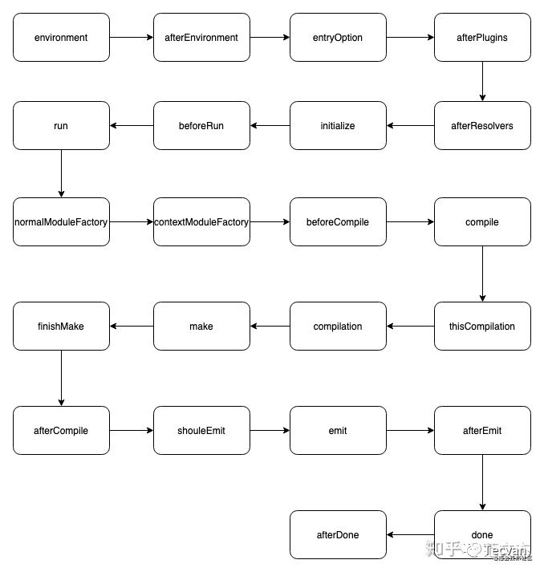

# webpack

**流程解析**
1. 初始化阶段
   1. 初始化参数(配置文件,shell，默认配置结合)
   2. 创建Compiler对象(全局唯一)
   3. 初始化编译环境(加载配置插件等)
   4. 开始编译(compiler.run)
   5. 确定入口(根据entry，调用compilation.addEntry)
2. 构建阶段
   1. 编译模块(创建module对象，调用loader将模板转译为js，调用js解释器将js转换为AST从而找到依赖模块。递归执行直到全部解析完毕)
   2. 完成模块编译(得到模块编译后内容以及依赖关系)
3. 生成阶段
   1. 输出资源(根据依赖关系组装多个chunk，再把每个chunk转换成一个单独的文件加入到输出列表，这步是可以修改输出内容的最后机会)
   2. 写入文件系统(根据配置确定输出路径和文件名，将文件内容写入文件系统)   
   
---
**初始化阶段**
   
1. 将 process.args + webpack.config.js 合并成用户配置
2. 调用 validateSchema 校验配置
3. 调用 getNormalizedWebpackOptions + applyWebpackOptionsBaseDefaults 合并出最终配置
4. 创建 compiler 对象
5. 遍历用户定义的 plugins 集合，执行插件的 apply 方法
6. 调用 new WebpackOptionsApply().process 方法，加载各种内置插件(例如处理entry配置的EntryOptionPlugin等)
7. 调用compiler.compile开始编译阶段   

---
**构建阶段**
   
整个流程：module => ast => dependence => module   
1. 调用 handleModuleCreate ，根据文件类型构建 module 子类
2. 调用 loader-runner 仓库的 runLoaders 转译 module 内容，通常是从各类资源类型转译为 JavaScript 文本
3. 调用 acorn 将 JS 文本解析为AST
4. 遍历 AST，触发各种钩子
   1. 在 HarmonyExportDependencyParserPlugin 插件监听 exportImportSpecifier 钩子，解读 JS 文本对应的资源依赖
   2. 调用 module 对象的 addDependency 将依赖对象加入到 module 依赖列表中
5. AST 遍历完毕后，调用 module.handleParseResult 处理模块依赖
6. 对于 module 新增的依赖，调用 handleModuleCreate ，控制流回到第一步
7. 所有依赖都解析完毕后，构建阶段结束   

---
**生成阶段**
   
1. 构建本次编译的 ChunkGraph 对象
2. 遍历 compilation.modules 集合，将 module 按 entry/动态引入 的规则分配给不同的 Chunk 对象
3. compilation.modules 集合遍历完毕后，得到完整的 chunks 集合对象，调用 createXxxAssets 方法
4. createXxxAssets 遍历 module/chunk ，调用 compilation.emitAssets 方法将 assets 信息记录到 compilation.assets 对象中
5. 触发 seal 回调，控制流回到 compiler 对象   

这一步的关键逻辑是将 module 按规则组织成 chunks ，webpack 内置的 chunk 封装规则比较简单：   
entry 及 entry 触达到的模块，组合成一个 chunk   
使用动态引入语句引入的模块，各自组合成一个 chunk   
对于重复引入的chunk，webpack会通过SplitChunksPlugin进行优化    

写入文件系统：seal 结束之后，紧接着调用 compiler.emitAssets 函数，函数内部调用 compiler.outputFileSystem.writeFile 方法将 assets 集合写入文件系统   

---
**Plugin解析**
1. 什么是插件：一个带有 apply 函数的类
   * class SomePlugin {   
       * apply(compiler) {   
         * compiler.hooks.thisCompilation.tap('SomePlugin', (compilation=>    {   
           *  compilation.hooks.optimizeChunkAssets.tapAsync('SomePlugin', ()=>{});})}}   
2. 什么时候触发钩子：触发时机与 webpack 工作过程紧密相关，大体上从启动到结束，compiler 对象逐次触发如下钩子：   
      
3. 如何影响编译状态：webpack 的插件体系与平常所见的 订阅/发布 模式差别很大，是一种非常强耦合的设计，hooks 回调由 webpack 决定何时，以何种方式执行；而在 hooks 回调内部可以通过修改状态、调用上下文 api 等方式对 webpack 产生 side effect。   

---
**Loader介绍**
1. 职责：将内容 A 转化为内容 B，但转译之后理论上应该输出标准 JavaScript 文本或者 AST 对象